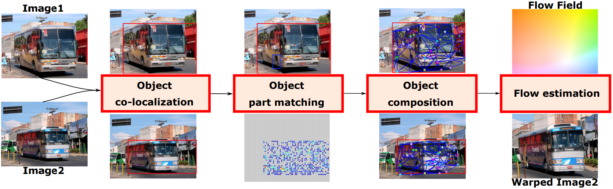

# Alignment by Composition
This is the multi-threaded MATLAB and C++ implementation of "[Alignment by Composition](https://bsevilmis.github.io/papers/wacv19.pdf)" appeared in WACV 2019.

## Abstract
We propose an unsupervised method to establish dense semantic correspondences between images depicting different instances of the same object category. We posit that alignment is compositional in nature and requires the detection of a similar visual concept between images. We realize this in a top-down fashion using objectness, saliency, and visual similarity cues to co-localize the regions of holistic foreground objects. Jointly maximizing visual similarity and bounding the geometric distortion induced by their configuration, the target foreground object is then composed by the subregions of the source foreground object. The resultant composition is used to form a dense motion field enabling the alignment. Experimental results on several benchmark datasets support the efficacy of the proposed method.

  

## Requirements
- MATLAB R2012b or higher on a Linux platform
- GNU gcc 4.9.0 or higher for OpenMP support

## Dependencies
  - Download and compile the external source dependencies
	  - [VLFeat-0.9.17](https://www.vlfeat.org/download/)
	  - [DSP](http://vision.cs.utexas.edu/projects/dsp/)
	  - [Selective Search](http://huppelen.nl/publications/SelectiveSearchCodeIJCV.zip)
	  - [MDF Saliency](https://sites.google.com/site/ligb86/mdfsaliency/)
	  - [R-FCN](https://github.com/albanie/mcnRFCN)
	  - [MatConvNet](https://www.vlfeat.org/matconvnet/)
- Download the datasets
	- [Caltech101](http://www.vision.caltech.edu/Image_Datasets/Caltech101/)
	- [PF-dataset](https://www.di.ens.fr/willow/research/proposalflow/dataset/PF-dataset.zip)
	- [PF-dataset-PASCAL](https://www.di.ens.fr/willow/research/proposalflow/dataset/PF-dataset-PASCAL.zip)
	- [TSS_CVPR2016](https://taniai.space/projects/cvpr16_dccs/)

## Instructions

 1. Check the "external" folder which provides empty subfolders for external source dependencies. Put the external source dependencies under their respective folders.
 2. Check the "datasets" folder which provides empty subfolders for datasets. Put the images provided by each dataset in their respective subfolders under the "datasets/Images" folder. The test image pairs used from each dataset are provided in the "datasets/ImageFileNames" folder.
 3. Prepare and put the ground truth correspondences for each dataset under the "datasets/GroundTruth" folder. Have a look at the "source/FLOWEvaluation.m", "source/PCKEvaluation.m", and the "sources/PCKEvaluation2.m" files to understand the file structure of the ground truth correspondences needed to evaluate algorithm performances.
 4. Run the R-FCN object detection code on each test image and save the results under the "datasets/ObjectDetections" folder.
 5. Run the MDF Saliency code on each test image and save the results under the "datasets/SaliencyMaps" folder.
 6. Compile and build the mex files of the source files "source/computeHOGSimilarityMatrix.cpp", "source/computeSimilarityMatrix.cpp", "source/computeSimilarityMatrixSymmetricVersion.cpp", and "source/slidingWindowSearch.cpp". The compilation instructions are provided in each source file.
 7. Modify the file paths specified in the "source/setAuxiliaryFilePaths.m" according to the root directory.
 8. Run the "main.m" to establish dense semantic correspondence between a pair of test images.
 9. The algorithm performance can be evaulated using the "source/FLOWEvaluation.m", "source/PCKEvaluation.m", and the "source/PCKEvaluation2.m" files.

## Paper
Please cite our paper if you use our code for your research.

	@inproceedings{sevilmis2019alignment,
	  title={Alignment by Composition},
	  author={Sevilmis, Berk and Kimia, Benjamin},
	  booktitle={2019 IEEE Winter Conference on Applications of Computer Vision (WACV)},
	  pages={2009--2018},
	  year={2019},
	  organization={IEEE}
	}

## Copyright and License
This research code is provided for academic use only. Commercial or industrial uses of this code is prohibited.
